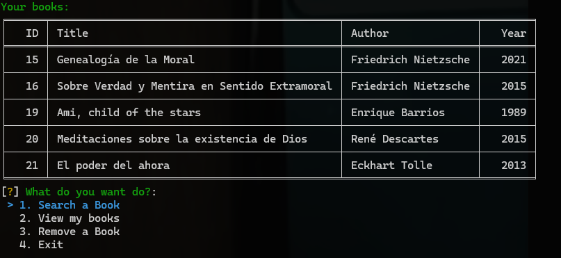

## Aplicación de Búsqueda de Lios

Esta aplicación permite buscar libros en la base de datos de Open Library y mostrar información sobre los resultados encontrados.

## Características
- Búsqueda rápida de libros por título.
- Muestra información clave como el título, autor y año de publicación.
- Formato de salida elegante en la consola.

1. Clona el repositorio

2. Instala las dependencias necesarias

3. Ejecuta el script y escribe el título del libro que deseas busca o agrega un libro a tu biblioteca

